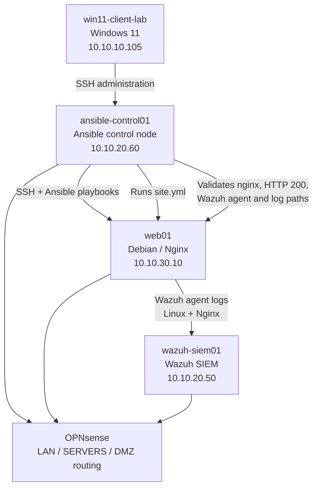
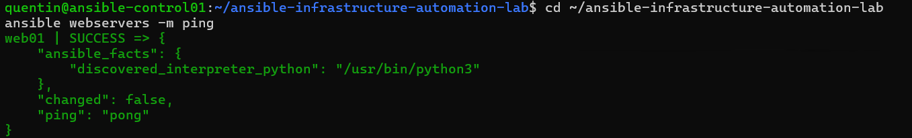
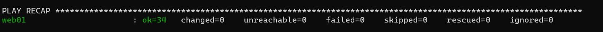
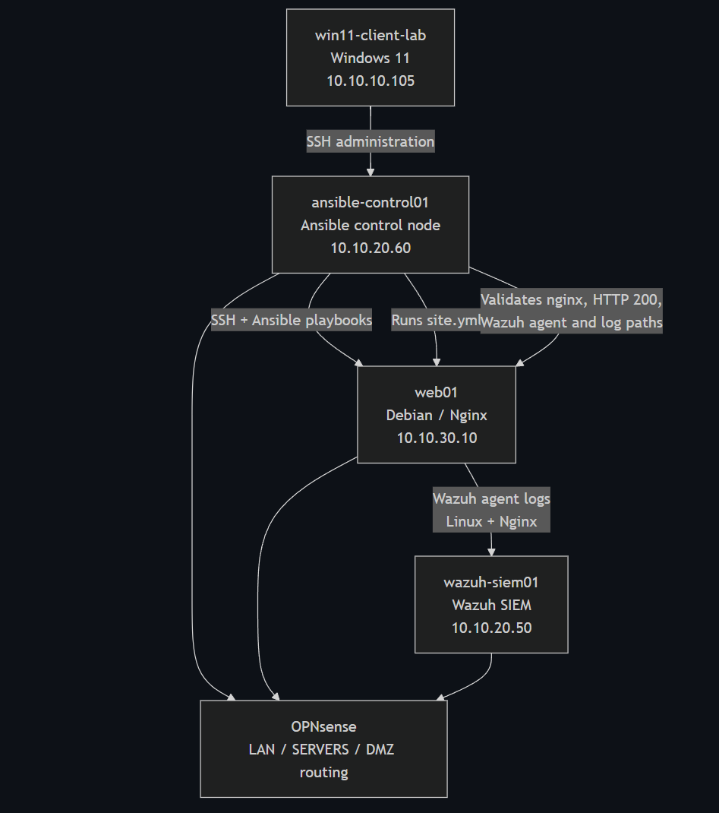

# Ansible Infrastructure Automation Lab

A practical infrastructure automation lab using Ansible to configure and validate Linux servers from a dedicated control node.

This project demonstrates how to manage a Debian/Nginx server with Ansible playbooks, SSH key authentication, inventory files and automated service validation.

## Lab Overview

The lab is hosted on Proxmox VE and uses an existing segmented homelab network.

Main systems:

| Hostname | IP address | Role |
|---|---|---|
| ansible-control01 | 10.10.20.60 | Ansible control node |
| web01 | 10.10.30.10 | Debian/Nginx web server managed by Ansible |
| wazuh-siem01 | 10.10.20.50 | Wazuh SIEM server used for log monitoring |

## Goals

The main goals of this project are:

- Deploy a dedicated Ansible control node
- Configure SSH key-based access to a managed Linux server
- Create an Ansible inventory
- Validate connectivity with Ansible ping
- Apply a Linux baseline configuration
- Configure an Nginx web server automatically
- Verify service status and HTTP response automatically
- Verify the Wazuh agent configuration on the managed server
- Demonstrate idempotent playbooks with changed=0 on repeated runs
- Document the project for a junior system administrator portfolio

## Architecture

Ansible runs from the control node and connects to managed servers over SSH.

Flow:

    ansible-control01  --->  web01
        Ansible SSH          Debian/Nginx server

The managed server is located in the DMZ network, while the control node is located in the SERVERS network.


## Architecture Diagram



The diagram shows how the Ansible control node manages the Debian/Nginx server over SSH and validates its services and Wazuh agent configuration.

## Inventory

The inventory file defines the managed servers.

File:

    inventory.ini

Current inventory:

    [webservers]
    web01 ansible_host=10.10.30.10 ansible_user=root

## Playbooks

The project currently includes these playbooks:

| Playbook | Purpose |
|---|---|
| playbooks/linux-baseline.yml | Installs baseline Linux packages and displays system information |
| playbooks/nginx-webserver.yml | Installs and configures Nginx with a custom web page |
| playbooks/wazuh-agent-check.yml | Verifies Wazuh agent installation, service status and configuration |
| playbooks/verify-services.yml | Verifies Nginx service, port 80, HTTP 200 response and log file |
| site.yml | Runs all playbooks in the correct order |

## Main Commands

Test Ansible connectivity:

    ansible webservers -m ping

Run the full automation:

    ansible-playbook site.yml

Run only the Linux baseline playbook:

    ansible-playbook playbooks/linux-baseline.yml

Run only the Nginx playbook:

    ansible-playbook playbooks/nginx-webserver.yml

Run only the Wazuh agent check:

    ansible-playbook playbooks/wazuh-agent-check.yml

Run only the service verification:

    ansible-playbook playbooks/verify-services.yml

## Validation Results

The full site playbook was executed successfully.

Final result:

    web01 : ok=34 changed=0 unreachable=0 failed=0 skipped=0 rescued=0 ignored=0

This confirms that:

- web01 is reachable by Ansible
- SSH key authentication works
- Linux baseline packages are present
- Nginx is installed and configured
- The custom web page is deployed
- HTTP validation returns status 200
- Wazuh agent is installed and running
- Wazuh manager is configured as 10.10.20.50
- Nginx custom access log is monitored
- The playbooks are idempotent

## Idempotence

The Nginx playbook and full site playbook were executed multiple times.

On repeated runs, Ansible returned:

    changed=0
    failed=0

This means the server was already in the expected state and Ansible did not make unnecessary changes.

## Project Structure

```text
.
|-- ansible.cfg
|-- inventory.ini
|-- playbooks
|   |-- linux-baseline.yml
|   |-- nginx-webserver.yml
|   |-- verify-services.yml
|   `-- wazuh-agent-check.yml
`-- site.yml
```

## Screenshots

### Ansible ping success



### Full site playbook validation



### Architecture diagram



## Skills Practiced

- Ansible basics
- SSH key-based administration
- Linux server automation
- YAML playbooks
- Inventory management
- Idempotent configuration management
- Nginx deployment automation
- Service validation with Ansible
- Wazuh agent validation
- Infrastructure documentation with Git and GitHub

## Status

Project status: In progress, with the current scope validated.

Current validation:

- Ansible control node installed
- SSH key authentication to web01 working
- Ansible inventory working
- Ansible ping successful
- Linux baseline playbook successful
- Nginx webserver playbook successful
- Wazuh agent check playbook successful
- Service verification playbook successful
- Full site.yml playbook successful
